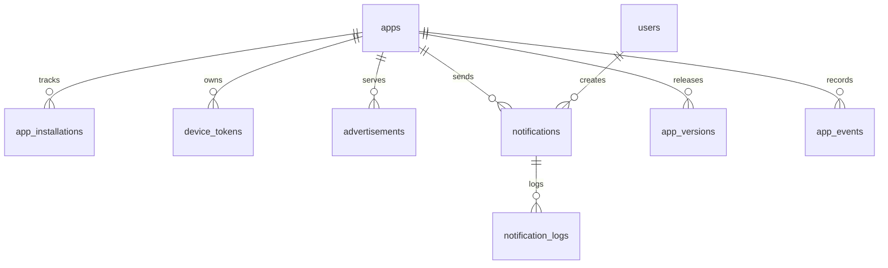

# Multi Android App Management Backend

## 1. High-level architecture

Laravel exposes versioned REST APIs under `/api/v1`. Android clients authenticate with `X-App-Id` and `X-Api-Key`; admins authenticate with Laravel Sanctum bearer tokens. Controllers validate requests, delegate work to services, and return the standard API envelope.

Core layers:
- `Http/Controllers/Api/V1/App`: Android-facing install, heartbeat, token, ads, version, event, and notification APIs.
- `Http/Controllers/Api/V1/Admin`: admin auth, CRUD, notification sending, and analytics.
- `Services`: business orchestration for app tracking, analytics, FCM, and notification dispatch.
- `Repositories`: persistence abstraction for admin CRUD.
- `Jobs`: queued notification fan-out.
- `Http/Requests`: validation and input normalization.
- `Http/Resources`: response serialization.

## 2. Database schema

Tables:
- `apps`: one row per managed Android app with `app_id`, `package_name`, `api_key`, version flags, maintenance flag, and status.
- `app_installations`: one row per app/device pair, unique on `app_id + device_id`, indexed for DAU/MAU.
- `device_tokens`: current FCM token per app/device pair, supports refresh, logout, and uninstall by toggling `is_active`.
- `advertisements`: app-specific dynamic ads with redirect type `url`, `screen`, `category`, or `product`.
- `notifications`: notification campaign history.
- `notification_logs`: per-token delivery results and FCM responses.
- `app_versions`: release history and force/optional update metadata.
- `app_events`: JSON analytics events such as `app_open`, `screen_view`, `ad_click`, `notification_open`, and `button_click`.

## 3. Migration files

Main schema: `database/migrations/2026_05_30_100000_create_mobile_app_management_tables.php`.
Sanctum token schema: published personal access token migration in `database/migrations`.

## 4. Model relationships

- `AndroidApp hasMany AppInstallation`
- `AndroidApp hasMany DeviceToken`
- `AndroidApp hasMany Advertisement`
- `AndroidApp hasMany PushNotification`
- `AndroidApp hasMany AppVersion`
- `AndroidApp hasMany AppEvent`
- `PushNotification hasMany NotificationLog`
- `PushNotification belongsTo AndroidApp`
- `NotificationLog belongsTo PushNotification`
- `Advertisement`, `AppVersion`, `AppEvent`, `DeviceToken`, and `AppInstallation` all belong to `AndroidApp`.

## 5. API routes

Android:
- `POST /api/v1/install`
- `POST /api/v1/heartbeat`
- `POST /api/v1/save-token`
- `GET /api/v1/ads`
- `GET /api/v1/version-check?current_version=1.0.0`
- `POST /api/v1/event`
- `GET /api/v1/notifications`

Admin:
- `POST /api/v1/admin/register`
- `POST /api/v1/admin/login`
- `GET /api/v1/admin/dashboard`
- `apiResource /api/v1/admin/apps`
- `apiResource /api/v1/admin/advertisements`
- `apiResource /api/v1/admin/notifications`
- `POST /api/v1/admin/notifications/{notification}/send`
- `apiResource /api/v1/admin/app-versions`

## 6. Controllers

Controllers are thin and return the standard envelope:

```json
{"status_code":200,"message":"Success message","data":{}}
```

Validation errors return:

```json
{"status_code":422,"message":"Validation failed","errors":{}}
```

Server errors return:

```json
{"status_code":500,"message":"Internal server error"}
```

## 7. Services

- `AppManagementService`: installation deduplication, heartbeat, token refresh, version management, and event storage.
- `NotificationService`: chunks active tokens and dispatches queue jobs.
- `FirebaseCloudMessagingService`: sends FCM HTTP v1 requests using a Google service account.
- `AnalyticsService`: total installs, daily installs, DAU, MAU, ad clicks, event counts, and notification success rate.

## 8. Repository layer

`BaseRepository` implements create, update, delete, and pagination. Entity-specific repositories wrap `AndroidApp`, `Advertisement`, `PushNotification`, and `AppVersion`.

## 9. Middleware

`AuthenticateApp` validates every Android API call against:
- app id
- api key
- active app status

Rate limits:
- app API: 300 requests/minute per app id/ip
- admin API: 120 requests/minute per user/ip
- login: 5 requests/minute per ip

## 10. Validation classes

Form requests define validation for install, heartbeat, token storage, events, admin login, apps, advertisements, notifications, and app versions. Redirect types and event names are whitelisted.

## 11. Queue jobs

`SendPushNotificationJob`:
- runs on `notifications` queue
- processes token chunks
- retries 3 times with 60 second backoff
- writes `notification_logs`
- increments success/failure campaign counters

Recommended worker:

```bash
php artisan queue:work redis --queue=notifications,default --tries=3 --timeout=120
```

## 12. Notification architecture

Admin creates a notification campaign, then calls `/admin/notifications/{notification}/send`. `NotificationService` chunks active tokens in batches of 500 and dispatches queued jobs. Each job sends via Firebase Cloud Messaging HTTP v1 and stores per-device delivery logs for future analytics.

Required env:

```env
QUEUE_CONNECTION=redis
FCM_PROJECT_ID=your-firebase-project-id
FCM_CREDENTIALS_PATH=/absolute/path/firebase-service-account.json
```

## 13. Swagger documentation

L5 Swagger annotations live in `app/Swagger/OpenApi.php`. Generate docs with:

```bash
php artisan l5-swagger:generate
```

## 14. Android integration guide

Send `X-App-Id` and `X-Api-Key` on every app API request.

Call flow:
- First launch: call `/install`, then `/save-token`, then `/version-check`.
- Every foreground/open: call `/heartbeat`, `/version-check`, and optionally `/ads`.
- On FCM token refresh: call `/save-token`.
- On logout/uninstall signal: call `/save-token` with `is_active=false` if the app can still reach the backend.
- On analytics actions: call `/event` with the whitelisted event name and JSON metadata.

Version response handling:
- `maintenance_mode=true`: block normal UI and show maintenance screen.
- `force_update=true`: block app usage and open Play Store/APK URL.
- `optional_update=true`: show dismissible update prompt.

FCM:
- Android registers with Firebase Messaging.
- Send the current FCM token to `/save-token`.
- For notification opens, send `/event` with `event_name=notification_open`.

## 15. ER diagram explanation

`apps` is the parent table. Operational data hangs from it: installations, tokens, ads, versions, notifications, and events. Notifications own many logs. Users create notification campaigns through `notifications.created_by`.



## 16. Scalability recommendations

- Use Redis for cache, queues, and rate limiter state.
- Run separate queue workers for `notifications`.
- Add read replicas for analytics dashboards.
- Partition or archive `app_events` and `notification_logs` by month once volume grows.
- Cache active ads and app version responses per app.
- Keep FCM credentials out of the repository and rotate app API keys.
- Add composite indexes before introducing new dashboard filters.
- Use Horizon for queue observability.

## 17. Production deployment recommendations

- Set `APP_ENV=production`, `APP_DEBUG=false`, `LOG_LEVEL=warning`.
- Run `php artisan config:cache`, `route:cache`, and `event:cache`.
- Use HTTPS only.
- Store uploads on S3-compatible object storage and validate MIME, size, and extension.
- Run database migrations in CI/CD with a backup/rollback plan.
- Configure queue supervisors with restart policies.
- Enable monitoring for API latency, queue depth, failed jobs, DB slow queries, and FCM failure rates.

## 18. Admin panel architecture

The admin panel is a session-authenticated Laravel Blade application under `/admin`.

Modules:
- Authentication: login, logout, forgot/reset password, profile, and change password.
- Registration: `/admin/register` creates an admin user, logs them in, and the API equivalent is `POST /api/v1/admin/register`.
- Dashboard: summary cards, app/date filters, Chart.js install/activity/event charts, and recent API activity.
- Apps: CRUD with a simplified create/edit form that accepts only app name and version; app id, package name, API key, status, force update, maintenance mode, and version fields are provisioned automatically. Activate/suspend, API key rotation, force update, maintenance mode, and CSV export remain available from the listing/actions.
- Installation analytics: install tables, device/version breakdowns, charts, filters, and export.
- Active users: DAU/MAU trend charts, app breakdown, and version usage.
- Advertisements: CRUD, scheduling, priority, redirect type, image upload/preview, and app filter.
- Notifications: create/edit/delete, image upload, redirect payloads, queue-based send, history, and logs.
- Versions: latest/minimum version control, force update, maintenance, APK URL, popup message, and change logs.
- Events: app opens, screen views, notification opens, ad clicks, button clicks, filters, and charts.
- API logs: method, path, status, latency, app id, IP address, search, and filtering.

Admin structure:
- Controllers: `app/Http/Controllers/Admin`
- Services: `app/Services/Admin`
- Repositories: `app/Repositories/Admin`
- Views: `resources/views/admin`
- Layout: `resources/views/admin/layouts/app.blade.php`
- API monitoring middleware: `app/Http/Middleware/LogApiRequest.php`
- Admin role middleware: `app/Http/Middleware/EnsureAdmin.php`

Security:
- Session auth protects all admin routes.
- `EnsureAdmin` requires `role` of `admin` or `super_admin`.
- CSRF is enabled for all Blade forms.
- Image uploads validate MIME and size, then store unique filenames on the public disk.
- API logging redacts sensitive request fields such as password and API key.

UI stack:
- Bootstrap 5 for layout and responsive UI.
- Chart.js for dashboard and analytics graphs.
- DataTables for searchable listings on paginated server-rendered tables.
- Laravel pagination for server-side paging.

Operational commands:

```bash
php artisan migrate --force
php artisan storage:link
php artisan queue:work redis --queue=notifications,default --tries=3 --timeout=120
```
